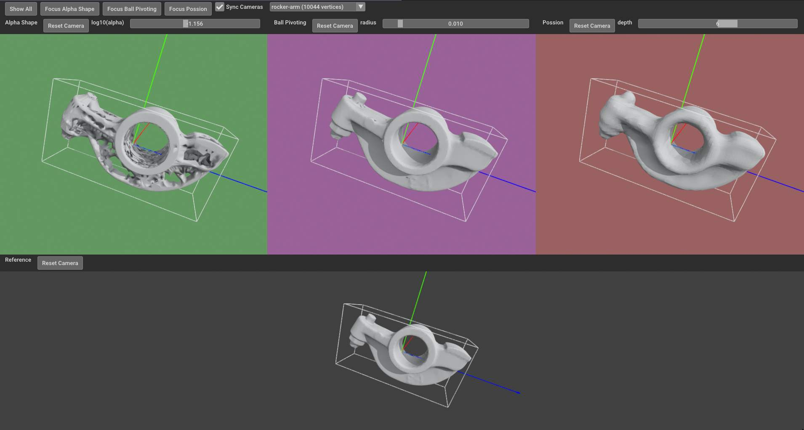

## Surface Reconstruction
This project implements three surface reconstruction algorithms: Alpha Shape, Ball Pivoting, and Poisson, each based on its original paper. The goal is to generate a 3D triangle mesh from an aligned point cloud. A visualization tool is also provided to facilitate visual comparison of the resulting meshes. 

Open3D includes implementations for all these three algorithms in C++, and we choose to build on Python based on the original papers for learning purposes. Some optimizations implemented in Open3D are dropped due to time constraints. We only use built-in methods in Open3D as a validation for checking the correctness of our implementations.




## Dependencies
If you use pip for your package management, run:
```bash
pip install -r ./requirements.txt
```

## Usage of Visualization Tool
```bash
python3 Main.py
```

## Project Structure
├── AlphaShape.py       Implementation of Alpha Shape algorithm
├── BallPivoting.py     Implementation of Ball Pivoting algorithm
├── Poisson.py          Implementation of Poisson algorithm
│
├── assets/*.obj        3D test models
├── Assets.py           Mesh loading and preprocessing
│
├── Layout.py           UI layout core pipeline
├── Main.py             Entry Point
│
├── Test.py             Correctness check with Open3D built-in method (Generated with ChatGPT)
└── Verify.py           Verify if Test.py can differentiate different methods

## Data Source
[Common 3D test models](github.com/alecjacobson/common-3d-test-models)

## Reference
- Bernardini, F., Mittleman, J., Rushmeier, H., Silva, C., & Taubin, G. (1999). The ball-pivoting algorithm for surface reconstruction. IEEE Transactions on Visualization and Computer Graphics, 5(4), 349–359. http://mesh.brown.edu/taubin/pdfs/bernardini-etal-tvcg99.pdf
- Edelsbrunner, H., & Mücke, E. P. (1994). Three-dimensional alpha shapes. ACM Transactions on Graphics, 13(1), 43–72. https://arxiv.org/pdf/math/9410208
- Kazhdan, M., Bolitho, M., & Hoppe, H. (2006). Poisson surface reconstruction. Eurographics Symposium on Geometry Processing. https://hhoppe.com/poissonrecon.pdf
- Digne, J. (2014). An analysis and implementation of a parallel ball pivoting algorithm. Image Processing On Line, 4, 149–168. https://www.ipol.im/pub/art/2014/81/article_lr.pdf
